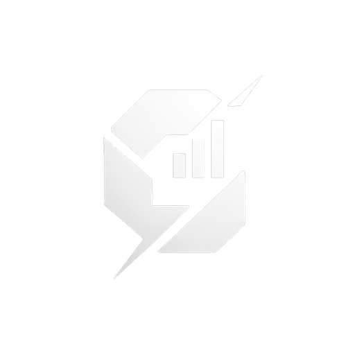
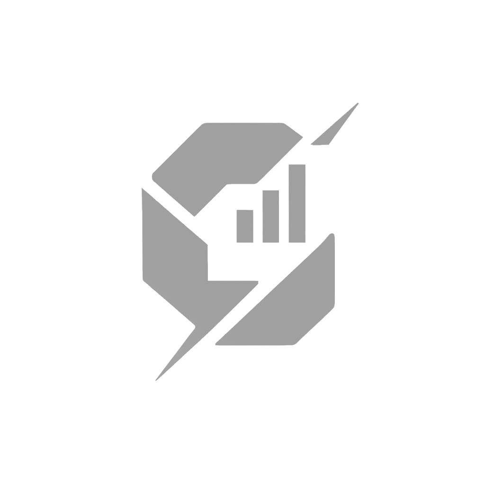

# Carbon Films — Design System v1.0

> **Status: Completo**
> Fonte unica de verdade para o site da Carbon Films.
> Todo desenvolvedor cria paginas a partir deste documento.
> Arquivos: `design-tokens.css` + `components.css` + `animations.css` + `utilities.css` + `assets/cf-core.js`

---

## Principios

| Principio | Descricao |
|-----------|-----------|
| **Cinematografico** | Cada elemento deve remeter a producao de video — precisao tecnica, contraste dramatico |
| **Zero Saturacao** | Nenhuma cor vibrante. Monocromatico total. Se nao for preto, cinza ou branco, nao entra |
| **Angular** | Zero border-radius em todos os elementos UI. Excecao unica: cursor circular |
| **Textura** | Film grain sutil em todas as paginas — identidade visual inalienavel |
| **Mono + Display** | JetBrains Mono para UI tecnica, Anton para impacto maximo |

---

## 1. Paleta de Cores

### Tokens

| Token | Valor | Uso principal | Contraste em #050505 |
|-------|-------|---------------|----------------------|
| `--cf-black` | `#050505` | Background body | — |
| `--cf-surface` | `#111111` | Cards, paineis | — |
| `--cf-elevated` | `#161616` | Elementos elevados | — |
| `--cf-glass` | `#1A1A1A` | Overlays, hover states | — |
| `--cf-border` | `#1F1F1F` | Bordas sutis padrao | — |
| `--cf-border2` | `#2A2A2A` | Bordas hover, separadores | — |
| `--cf-dim` | `#3A3A3A` | Desabilitados, placeholders | — |
| `--cf-gray-600` | `#6B6B6B` | Metadados, timestamps | 2.8:1 |
| `--cf-gray-400` | `#A0A0A0` | Texto secundario | 4.6:1 (AA large) |
| `--cf-white` | `#FFFFFF` | Texto principal, accent | 19.8:1 (AAA) |

### Contraste WCAG 2.1

| Combinacao | Ratio | Nivel | Uso recomendado |
|------------|-------|-------|-----------------|
| `#FFFFFF` em `#050505` | 19.8:1 | AAA | Texto principal, botoes |
| `#FFFFFF` em `#111111` | 17.1:1 | AAA | Texto em cards |
| `#A0A0A0` em `#050505` | 4.6:1 | AA | Texto secundario (body >=16px) |
| `#A0A0A0` em `#111111` | 4.0:1 | AA large | Labels, tags (usar >=14px bold) |
| `#6B6B6B` em `#050505` | 2.8:1 | FAIL | Apenas metadados decorativos |
| `#6B6B6B` em `#111111` | 2.4:1 | FAIL | Nao usar para texto essencial |

> Regra: `--cf-gray-600` e apenas para texto decorativo/ornamental. Texto funcional usa `--cf-gray-400` no minimo.

### Hierarquia visual de superficies

```
#050505  body background
  └── #111111  cards, secoes alternadas
        └── #161616  elementos elevados (hover state de card)
              └── #1A1A1A  glass overlay, modais
```

---

## 2. Tipografia

### Fontes

```html
<!-- Google Fonts — incluir em toda pagina -->
<link rel="preconnect" href="https://fonts.googleapis.com">
<link rel="preconnect" href="https://fonts.gstatic.com" crossorigin>
<link href="https://fonts.googleapis.com/css2?family=Anton&family=Montserrat:wght@300;400;700;800&family=Playfair+Display:ital,wght@1,400;1,500;1,600&family=JetBrains+Mono:wght@300;400;500&display=swap" rel="stylesheet">
```

| Familia | Token | Uso | Pesos carregados |
|---------|-------|-----|-----------------|
| Anton | `--cf-font-display` | Hero, display, titulos enormes | 400 (unico) |
| Montserrat | `--cf-font-body` | Body, UI, headings de secao | 300, 400, 700, 800 |
| Playfair Display | `--cf-font-italic` | Citacoes, decorativo, destaques | italic 400, 500, 600 |
| JetBrains Mono | `--cf-font-mono` | Labels, tags, nav, botoes, badges | 300, 400, 500 |

### Escala tipografica

| Token | Valor | Rem | Uso |
|-------|-------|-----|-----|
| `--cf-text-xs` | 0.58rem | ~9.3px | Tags de secao, metadados extremos |
| `--cf-text-sm` | 0.62rem | ~9.9px | Labels, nav links, botoes mono |
| `--cf-text-base` | 1rem | 16px | Corpo de texto padrao |
| `--cf-text-lg` | 1.125rem | 18px | Texto maior, paragrafos intro |
| `--cf-text-xl` | 1.5rem | 24px | Subheadings, Playfair italic |
| `--cf-text-2xl` | 2rem | 32px | Headings de secao menores |
| `--cf-text-3xl` | clamp(1.5rem, 2.5vw, 2.4rem) | 24-38px | Section heading responsivo |
| `--cf-text-display` | clamp(3rem, 8vw, 7rem) | 48-112px | Hero display — Anton |

### Tracking (letter-spacing)

| Token | Valor | Uso |
|-------|-------|-----|
| `--cf-tracking-tight` | 0.02em | Headings display Anton |
| `--cf-tracking-normal` | 0.04em | Section headings Montserrat |
| `--cf-tracking-wide` | 0.35em | Labels, tags, botoes mono |
| `--cf-tracking-wider` | 0.5em | Section labels, decorativo |

### Exemplos de uso tipografico

```css
/* Hero principal */
.hero-title {
  font-family: var(--cf-font-display);
  font-size: var(--cf-text-display);
  font-weight: 400;
  text-transform: uppercase;
  line-height: 0.92;
}

/* Heading de secao */
.section-title {
  font-family: var(--cf-font-body);
  font-size: var(--cf-text-3xl);
  font-weight: 800;
  text-transform: uppercase;
  letter-spacing: 0.04em;
}

/* Label mono */
.label {
  font-family: var(--cf-font-mono);
  font-size: 0.58rem;
  letter-spacing: 0.5em;
  text-transform: uppercase;
  color: var(--cf-gray-400);
}

/* Citacao decorativa */
.quote {
  font-family: var(--cf-font-italic);
  font-style: italic;
  font-size: var(--cf-text-xl);
}
```

---

## 3. Espacamento

### Escala (base 4px)

| Token | Valor | Uso tipico |
|-------|-------|-----------|
| `--cf-space-1` | 4px | Gap icone-texto, micro espacos |
| `--cf-space-2` | 8px | Padding interno de badges/tags |
| `--cf-space-3` | 12px | Padding de tags, gaps pequenos |
| `--cf-space-4` | 16px | Padding de inputs, gaps de formulario |
| `--cf-space-6` | 24px | Gap de nav links, grid gap |
| `--cf-space-8` | 32px | Padding de cards |
| `--cf-space-12` | 48px | Spacing entre elementos de secao |
| `--cf-space-16` | 64px | Spacing maior entre blocos |
| `--cf-space-20` | 80px | Section padding tablet |
| `--cf-space-24` | 96px | Spacing generoso |
| `--cf-space-30` | 120px | Section padding desktop |

### Section padding

| Viewport | Eixo Y | Eixo X |
|----------|--------|--------|
| Desktop (>1024px) | 120px | 72px |
| Tablet (640-1024px) | 80px | 48px |
| Mobile (<640px) | 60px | 24px |

---

## 4. Z-index Scale

| Token | Valor | Elemento |
|-------|-------|----------|
| `--cf-z-grain` | 9000 | Film grain overlay |
| `--cf-z-cursor` | 9999 | Cursor dot |
| `--cf-z-cursor2` | 9998 | Cursor ring |
| `--cf-z-tooltip` | 400 | Tooltips |
| `--cf-z-modal` | 300 | Modais |
| `--cf-z-nav` | 200 | Navegacao fixa |
| `--cf-z-overlay` | 100 | Overlays de imagem |

---

## 5. Animacao

### Duracoes

| Token | Valor | Uso |
|-------|-------|-----|
| `--cf-duration-fast` | 150ms | Hover simples (cor, borda) |
| `--cf-duration-base` | 250ms | Transicoes de componentes |
| `--cf-duration-slow` | 400ms | Animacoes de entrada, modais |
| `--cf-duration-slower` | 600ms | Transicoes de pagina, overlays |

### Easings

| Token | Curva | Uso |
|-------|-------|-----|
| `--cf-ease-out` | `cubic-bezier(0.0, 0.0, 0.2, 1)` | Saidas, desaparece |
| `--cf-ease-in` | `cubic-bezier(0.4, 0.0, 1, 1)` | Entradas, aparece |
| `--cf-ease-inout` | `cubic-bezier(0.4, 0.0, 0.2, 1)` | Transicoes bidirecionais |
| `--cf-ease-snap` | `cubic-bezier(0.16, 1, 0.3, 1)` | Hover lift, elementos com "snap" |

---

## 6. Bordas

| Token | Valor | Uso |
|-------|-------|-----|
| `--cf-border-width` | 1px | Padrao em todos os elementos |
| `--cf-border-width-2` | 2px | Enfase, foco |
| `--cf-radius` | 0 | Zero radius — regra absoluta |
| `--cf-radius-circle` | 50% | UNICA excecao: cursor dot e ring |

---

## 7. Componentes

### 7.1 Botao Primary — `.cf-btn-primary`

Branco solido. Inverte no hover.

```html
<a href="/contato" class="cf-btn-primary">Iniciar Projeto</a>
<button class="cf-btn-primary">Enviar</button>
```

```
Estado normal:    [ INICIAR PROJETO ] branco bg / preto texto
Estado hover:     [ INICIAR PROJETO ] transparente bg / branco texto / borda branca
Estado foco:      outline 2px branco, offset 2px
```

---

### 7.2 Botao Ghost — `.cf-btn-ghost`

Borda branca, fundo transparente. Inverte no hover.

```html
<a href="/portfolio" class="cf-btn-ghost">Ver Portfolio</a>
```

```
Estado normal:    [ VER PORTFOLIO ] transparente bg / branco texto / borda branca
Estado hover:     [ VER PORTFOLIO ] branco bg / preto texto
```

---

### 7.3 Botao Mono — `.cf-btn-mono`

Apenas texto + underline. Estilo minimalista de link.

```html
<button class="cf-btn-mono">Saiba mais</button>
```

```
Estado normal:    saiba mais  (cinza, underline sutil)
Estado hover:     SAIBA MAIS  (branco, underline branco)
```

---

### 7.4 Tag — `.cf-tag`

Label monoespaco com fundo surface.

```html
<span class="cf-tag">Marketing Visual</span>
<span class="cf-tag">Producao Audiovisual</span>
```

```css
/* Estrutura */
background: #111111;
border: 1px solid #1F1F1F;
font: 300 0.58rem/1 'JetBrains Mono';
letter-spacing: 0.35em;
text-transform: uppercase;
color: #A0A0A0;
```

---

### 7.5 Section Label — `.cf-sec-label`

Label de inicio de secao com linha decorativa.

```html
<div class="cf-sec-label">Nossos Servicos</div>
```

```
— — — NOSSOS SERVICOS
(linha 24px + gap 14px + texto mono uppercase)
```

---

### 7.6 Card Padrao — `.cf-card`

Card dark com hover lift de 4px.

```html
<article class="cf-card">
  <div class="cf-sec-label">Branding</div>
  <h3 class="cf-heading-section">Identidade Visual</h3>
  <p class="cf-text-body">Descricao do servico aqui.</p>
</article>
```

```
Normal:  bg #111111  |  borda #1F1F1F  |  translateY(0)
Hover:   bg #161616  |  borda #2A2A2A  |  translateY(-4px)
```

---

### 7.7 Card Glass — `.cf-card-glass`

Vidro escuro com backdrop-filter blur.

```html
<div class="cf-card-glass">
  <p class="cf-text-body">Conteudo sobre overlay.</p>
</div>
```

```css
background: rgba(26, 26, 26, 0.7);
border: 1px solid rgba(255, 255, 255, 0.06);
backdrop-filter: blur(20px);
```

> Usar apenas sobre imagens ou backgrounds. Sem backdrop-filter o efeito nao aparece.

---

### 7.8 Navegacao — `.cf-nav`

Nav fixa no topo com blur e gradient escuro.

```html
<nav class="cf-nav">
  <a href="/" class="cf-nav__logo-wrap">
    
  </a>
  <ul class="cf-nav__links">
    <li><a href="/servicos" class="cf-nav__link" aria-current="page">Servicos</a></li>
    <li><a href="/portfolio" class="cf-nav__link">Portfolio</a></li>
    <li><a href="/sobre" class="cf-nav__link">Sobre</a></li>
    <li><a href="/contato" class="cf-btn-primary">Contato</a></li>
  </ul>
</nav>
```

```
Posicao: fixed, top 0, z-index 200
Fundo:   gradient rgba(5,5,5,.97) → transparente + blur 14px
Logo:    height 38px, opacity 0.92
Links:   JetBrains Mono, 0.62rem, 0.35em tracking, uppercase, cinza
Hover:   cor branca + underline animado via ::after
```

---

### 7.9 Section — `.cf-section` + `.cf-container`

Padding padrao de secao com container centrado.

```html
<section class="cf-section">
  <div class="cf-container">
    <!-- conteudo -->
  </div>
</section>
```

```
.cf-section:    padding 120px 72px (responsivo)
.cf-container:  max-width 1280px, centrado
```

---

### 7.10 Divider — `.cf-divider`

Linha separadora 1px.

```html
<hr class="cf-divider">
```

---

### 7.11 Grain Overlay — `.cf-grain`

Textura de filme sobre toda a pagina.

```html
<!-- Adicionar logo apos <body> -->
<div class="cf-grain" aria-hidden="true"></div>
```

> Alternativa via body::after (ver template base).

---

### 7.12 Cursor Customizado — `.cf-cursor`

Dot + ring com lag suave.

```html
<!-- Adicionar logo apos <body> -->
<div class="cf-cursor" aria-hidden="true">
  <div class="c-dot"></div>
  <div class="c-ring"></div>
</div>
```

```javascript
// JS obrigatorio — copiar em toda pagina
const dot  = document.querySelector('.c-dot');
const ring = document.querySelector('.c-ring');
let mx = 0, my = 0, rx = 0, ry = 0;
document.addEventListener('mousemove', e => { mx = e.clientX; my = e.clientY; });
(function animate() {
  dot.style.left  = mx + 'px';
  dot.style.top   = my + 'px';
  rx += (mx - rx) * 0.12;
  ry += (my - ry) * 0.12;
  ring.style.left = rx + 'px';
  ring.style.top  = ry + 'px';
  requestAnimationFrame(animate);
})();
```

---

### 7.13 Heading Display — `.cf-heading-display`

Anton uppercase para hero.

```html
<h1 class="cf-heading-display">Carbon Films</h1>
```

```css
font-family: 'Anton', sans-serif;
font-size: clamp(3rem, 8vw, 7rem);
text-transform: uppercase;
line-height: 0.92;
```

---

### 7.14 Heading Section — `.cf-heading-section`

Montserrat 800 uppercase para titulos de secao.

```html
<h2 class="cf-heading-section">Nossos Servicos</h2>
```

```css
font-family: 'Montserrat', sans-serif;
font-weight: 800;
font-size: clamp(1.5rem, 2.5vw, 2.4rem);
text-transform: uppercase;
letter-spacing: 0.04em;
```

---

### 7.15 Body Text — `.cf-text-body`

Montserrat 300 para paragrafos.

```html
<p class="cf-text-body">Texto corrido aqui.</p>
```

---

### 7.16 Mono Text — `.cf-text-mono`

JetBrains Mono uppercase para UI tecnica.

```html
<span class="cf-text-mono">CF_001</span>
```

---

### 7.17 Italic Text — `.cf-text-italic`

Playfair Display italic para citacoes ou destaques decorativos.

```html
<blockquote class="cf-text-italic">
  "A imagem e a primeira impressao da sua marca."
</blockquote>
```

---

### 7.18 Badge — `.cf-badge`

Codigo de referencia estilo `CF_001`.

```html
<span class="cf-badge">CF_001</span>
```

```css
border: 1px solid #2A2A2A;
font: 300 0.5rem/1 'JetBrains Mono';
letter-spacing: 0.15em;
text-transform: uppercase;
color: #3A3A3A;
```

---

### 7.19 Overlay de Imagem — `.cf-overlay`

Escurece imagens com overlay.

```html
<div class="cf-overlay">
  
  <!-- conteudo sobre a imagem aqui -->
</div>
```

```
Normal:  ::after rgba(5,5,5,0.7)
Hover:   ::after rgba(5,5,5,0.5)  — revela mais da imagem
Filhos:  z-index 1 (acima do overlay)
```

---

### 7.20 Input — `.cf-input`

Campo de texto dark.

```html
<input type="text" class="cf-input" placeholder="Seu nome">
<textarea class="cf-input" placeholder="Mensagem"></textarea>
<select class="cf-input">
  <option>Selecione</option>
</select>
```

```
Normal:  bg #111111  |  borda #1F1F1F
Hover:   bg #161616  |  borda #2A2A2A
Focus:   bg #1A1A1A  |  borda #FFFFFF
Placeholder: JetBrains Mono, 0.35em tracking, uppercase, #3A3A3A
```

---

## 8. Grid & Layout

### Grid de 12 colunas

```html
<div class="cf-grid">
  <div style="grid-column: span 6">Metade esquerda</div>
  <div style="grid-column: span 6">Metade direita</div>
</div>
```

```
Desktop:  12 colunas, gap 24px
Tablet:   6 colunas, gap 24px
Mobile:   1 coluna
```

### Breakpoints

| Nome | Valor | Mudancas |
|------|-------|---------|
| Desktop | > 1024px | Layout completo, padding maximo |
| Tablet | 640–1024px | Grid 6 col, padding reduzido |
| Mobile | < 640px | 1 coluna, padding minimo |

---

## 9. Acessibilidade

### Estados de foco

Todo elemento interativo recebe foco visivel ao navegar por teclado:

```css
:focus-visible {
  outline: 2px solid #FFFFFF;
  outline-offset: 2px;
}
```

### Motion reduced

Respeitar `prefers-reduced-motion` — ja implementado em `components.css`:

```css
@media (prefers-reduced-motion: reduce) {
  *, *::before, *::after {
    animation-duration: 0.01ms !important;
    transition-duration: 0.01ms !important;
  }
}
```

### Skip link

```html
<a href="#main" class="cf-skip-link">Pular para o conteudo</a>
```

### Checklist de acessibilidade por pagina

```
[ ] Todos os  tem alt descritivo
[ ] Elementos de cursor e grain tem aria-hidden="true"
[ ] Nav usa <nav> com aria-label
[ ] Links ativos tem aria-current="page"
[ ] Contraste de texto >= AA (ver tabela secao 1)
[ ] Tab order logico
[ ] Formularios tem <label> associado
```

---

## 10. Template Base de Pagina

HTML completo pronto para uso. Copiar e modificar para cada nova pagina.

```html
<!DOCTYPE html>
<html lang="pt-BR">
<head>
  <meta charset="UTF-8">
  <meta name="viewport" content="width=device-width, initial-scale=1.0">
  <title>Carbon Films — [Nome da Pagina]</title>

  <!-- Fonts -->
  <link rel="preconnect" href="https://fonts.googleapis.com">
  <link rel="preconnect" href="https://fonts.gstatic.com" crossorigin>
  <link href="https://fonts.googleapis.com/css2?family=Anton&family=Montserrat:wght@300;400;700;800&family=Playfair+Display:ital,wght@1,400;1,500;1,600&family=JetBrains+Mono:wght@300;400;500&display=swap" rel="stylesheet">

  <!-- Design System -->
  <link rel="stylesheet" href="design-tokens.css">
  <link rel="stylesheet" href="components.css">

  <style>
    /* Grain via body::after */
    body::after {
      content: '';
      position: fixed;
      inset: 0;
      background-image: url("data:image/svg+xml,%3Csvg viewBox='0 0 512 512' xmlns='http://www.w3.org/2000/svg'%3E%3Cfilter id='n'%3E%3CfeTurbulence type='fractalNoise' baseFrequency='0.75' numOctaves='4' stitchTiles='stitch'/%3E%3C/filter%3E%3Crect width='100%25' height='100%25' filter='url(%23n)' opacity='0.035'/%3E%3C/svg%3E");
      pointer-events: none;
      z-index: var(--cf-z-grain);
      opacity: var(--cf-grain-opacity);
    }

    /* Estilos especificos da pagina aqui */
  </style>
</head>
<body>

  <!-- Skip link (acessibilidade) -->
  <a href="#main" class="cf-skip-link">Pular para o conteudo</a>

  <!-- Cursor customizado -->
  <div class="cf-cursor" aria-hidden="true">
    <div class="c-dot"></div>
    <div class="c-ring"></div>
  </div>

  <!-- Navegacao -->
  <nav class="cf-nav" aria-label="Navegacao principal">
    <a href="/">
      
    </a>
    <ul class="cf-nav__links">
      <li><a href="/servicos" class="cf-nav__link">Servicos</a></li>
      <li><a href="/portfolio" class="cf-nav__link">Portfolio</a></li>
      <li><a href="/sobre" class="cf-nav__link">Sobre</a></li>
      <li><a href="/contato" class="cf-btn-primary">Contato</a></li>
    </ul>
  </nav>

  <!-- Conteudo principal -->
  <main id="main">

    <!-- Hero de exemplo -->
    <section class="cf-section" style="padding-top: 180px;">
      <div class="cf-container">
        <div class="cf-sec-label">Carbon Films</div>
        <h1 class="cf-heading-display">Titulo da<br>Pagina</h1>
        <p class="cf-text-body" style="max-width: 560px; margin-top: 32px;">
          Descricao da pagina aqui. Montserrat 300, line-height 1.7.
        </p>
        <div style="display: flex; gap: 16px; margin-top: 48px;">
          <a href="/contato" class="cf-btn-primary">Iniciar Projeto</a>
          <a href="/portfolio" class="cf-btn-ghost">Ver Portfolio</a>
        </div>
      </div>
    </section>

    <!-- Secao de cards de exemplo -->
    <section class="cf-section">
      <div class="cf-container">
        <div class="cf-sec-label">Servicos</div>
        <h2 class="cf-heading-section" style="margin-bottom: 48px;">O que fazemos</h2>

        <div class="cf-grid">
          <article class="cf-card" style="grid-column: span 4;">
            <span class="cf-badge" style="margin-bottom: 16px;">CF_001</span>
            <h3 class="cf-heading-section" style="font-size: 1.25rem; margin-bottom: 12px;">Marketing Visual</h3>
            <p class="cf-text-body">Conteudo estrategico para redes sociais e campanhas digitais.</p>
          </article>
          <article class="cf-card" style="grid-column: span 4;">
            <span class="cf-badge" style="margin-bottom: 16px;">CF_002</span>
            <h3 class="cf-heading-section" style="font-size: 1.25rem; margin-bottom: 12px;">Producao de Video</h3>
            <p class="cf-text-body">Filmagem e edicao profissional para marca e produto.</p>
          </article>
          <article class="cf-card" style="grid-column: span 4;">
            <span class="cf-badge" style="margin-bottom: 16px;">CF_003</span>
            <h3 class="cf-heading-section" style="font-size: 1.25rem; margin-bottom: 12px;">Identidade Visual</h3>
            <p class="cf-text-body">Branding completo: logo, paleta, tipografia e aplicacoes.</p>
          </article>
        </div>
      </div>
    </section>

  </main>

  <!-- Script do cursor -->
  <script>
    const dot  = document.querySelector('.c-dot');
    const ring = document.querySelector('.c-ring');
    let mx = 0, my = 0, rx = 0, ry = 0;
    document.addEventListener('mousemove', e => { mx = e.clientX; my = e.clientY; });
    (function animate() {
      dot.style.left  = mx + 'px';
      dot.style.top   = my + 'px';
      rx += (mx - rx) * 0.12;
      ry += (my - ry) * 0.12;
      ring.style.left = rx + 'px';
      ring.style.top  = ry + 'px';
      requestAnimationFrame(animate);
    })();
  </script>

</body>
</html>
```

---

## 11. Padroes proibidos

| Proibido | Alternativa correta |
|----------|---------------------|
| Qualquer cor saturada (vermelho, azul, verde...) | Usar apenas a paleta de tokens |
| Gold, dourado, amarelo | Removido definitivamente da identidade |
| `border-radius` em elementos UI | `border-radius: 0` (exceto cursor) |
| Classes sem prefixo `cf-` | Sempre prefixar com `cf-` |
| Texto funcional em `--cf-gray-600` | Usar `--cf-gray-400` no minimo |
| Preprocessor (Sass, Less) | CSS vanilla com custom properties |
| Animacoes sem `prefers-reduced-motion` | Envolver em media query |

---

## 12. Arquivos do Design System

| Arquivo | Funcao |
|---------|--------|
| `design-system.md` | Documentacao completa (este arquivo) |
| `DESIGN.md` | Design brief em YAML — tokens formais para ferramentas |
| `design-tokens.css` | Todas as variaveis CSS — importar primeiro |
| `components.css` | Todos os componentes `.cf-*` — importar depois |
| `animations.css` | Keyframes, scroll reveal, transicoes, skeleton, spinner |
| `utilities.css` | Classes utilitarias (flex, gap, margin, padding, display) |
| `assets/cf-core.js` | Cursor customizado, scroll reveal, contadores, grain |
| `demo.html` | Pagina de demonstracao completa do design system |

**Ordem de importacao obrigatoria:**
```html
<link rel="stylesheet" href="design-tokens.css">
<link rel="stylesheet" href="components.css">
<link rel="stylesheet" href="animations.css">
<link rel="stylesheet" href="utilities.css">
<!-- seus estilos especificos por ultimo -->
<script src="assets/cf-core.js" defer></script>
```

---

## 13. Logo — Arquivos e Variacoes

Simbolo: escudo geometrico com corte de relampago diagonal e grafico de barras interno. Identidade cinematografica angular, zero curvas.

### Variacoes disponiveis

| Arquivo | Tamanho | Fundo | Uso |
|---------|---------|-------|-----|
| `assets/logo-white.png` | 1024×1024 | Transparente | Uso principal — sobre fundos escuros |
| `assets/logo-black.png` | 1024×1024 | Transparente | Sobre fundos claros (impressao, papel) |
| `assets/logo-gray.png` | 1024×1024 | Transparente | Estados secundarios, rodape, marca-dagua |
| `assets/logo-white-on-black.png` | 1024×1024 | `#050505` | Preview, thumbnail, OG image |
| `assets/logo-black-on-white.png` | 1024×1024 | Branco | Documentos, contratos, impressao |
| `assets/logo-white-sm.png` | 512×512 | Transparente | Uso web otimizado |
| `assets/favicon-64.png` | 64×64 | Transparente | Favicon, app icon |

### Regras de uso

```
Fundo escuro (#050505, #111111):   usar logo-white.png
Fundo claro (branco, cinza claro): usar logo-black.png
Estado desabilitado / sutil:       usar logo-gray.png
Sempre manter proporcao 1:1
Tamanho minimo recomendado: 32px
Nunca aplicar border-radius no container da logo
```

### HTML de uso padrao

```html
<!-- Nav (fundo escuro) -->


<!-- Favicon — no <head> -->
<link rel="icon" type="image/png" href="assets/favicon-64.png">

<!-- Footer ou marca-dagua -->

```
